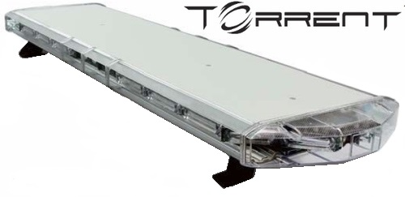
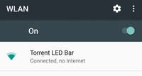
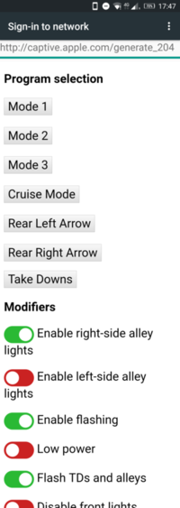
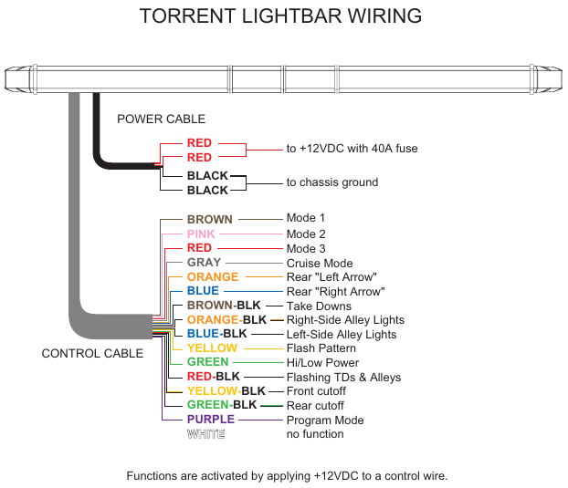

# Purpose
The purpose of this project is to create a Wifi controller for an orange Axixtech Torrent Led Light Bar.  

The ESP8266 micro-controller creates a Wifi access point.  
When connected to it, the user is redirected to a web page where he can change the illumination mode.  

  

# Realisation

According to [the manual](../master/doc/TORRENT%20Lightbar%20Operation%20Manual.pdf) the wiring is extremely simple.  
To select a mode, one should just connect one of the wires to 12V.  
Therefore, the system will connect the different wires to 12V using transistors according to the output of a shift registers controlled by a web page.  

.

## Code

The ESP8266 code contains the HTML page, therefore all the code is in one file [TorrentBar.ino](../master/TorrentBar/TorrentBar.ino).  
The webpage is also available in the file [TorrentBar.html](../master/doc/TorrentBar.html) for testing purposes.  

## Electronics

The circuit is rather simple, based on Darlington NPN transistor arrays and shift registers.  
The car battery supplies the 12V, which is reduced to 5V using a LM7805 voltage regulator.  
The 3.3V is either supplied by a LD1117V33 regulator (optional) or by the regulator located on the ESP8266 D1 Mini board.  

[My EDA project can be found here](https://easyeda.com/arnaud.dessein/torrent-light-bar)  

  

  

