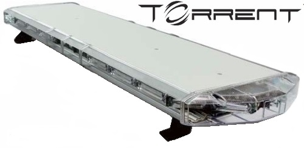
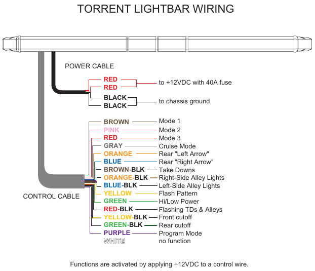

# Purpose
The purpose of this project is to create a Wifi controller for an orange Axixtech Torrent Led Light Bar.  

# Realisation

According to [the manual](../master/TORRENT%20Lightbar%20Operation%20Manual.pdf) the wiring is extremely simple.  
To select a mode, one should just connect one of the wires to 12V.  

.

## Electronics

The circuit is rather simple, based on Darlington NPN transistor arrays and shift registers.  
[My EDA project can be found here](https://easyeda.com/arnaud.dessein/torrent-light-bar)  

  
  

## Code

The ESP8266 will behave as an access point.
Once connected to it, the user can change the flashing modes on a web page. 
I will probably get inspiration from [this page](https://circuits4you.com/2016/12/16/esp8266-web-server-html/).
