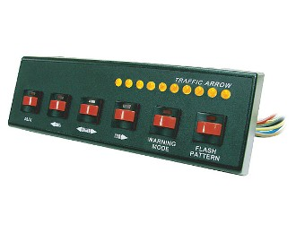

# Purpose
The purpose of this project is to create a Wifi controller for an orange Axixtech Torrent Led Light Bar.
This device is a safety light device that can be mounted on a vehicule for signaling danger, roadworks...
It is originaly delivered with a very simple control panel made of push buttons.

The purpose of this project is to create a system for the user to be able to control the light bar wirelessly, using his smartphone.

# Realisation

According to [the manual](../master/doc/TORRENT%20Lightbar%20Operation%20Manual.pdf) the bar is controlled by 15 wires. The voltage at these wires should either be 0 or 12V, respectively low and high level. Some wires should be hold at high level continuously of activating functions, more advanced ones requires mode selection by tapping several times on the wire (sending 12V pulses).

I have decided to make the electonic design as simple as possible: 
 - an ESP8266 is the main controllers: it creates a Wifi access point and sends a webpage to the client.
 - when the user select a function, the controller prepare the wire configuration state and pushes these states to shift registers.
 - since the voltae should be 12V, two Darlington NPN transistor arrays are used. Because they are NPN, they will be used to pull down the voltage when their emitter-base votage is positive. Which means that the controller should control using inversed logic (the shift registed should output 0V for the corresponding wire to be set to 12V and 3.3V for the wire to be set to 0V)

.

The ESP8266 micro-controller creates a Wifi access point.  
When connected to it, the user is redirected to a web page where he can change the illumination mode.  

  

## Code

The ESP8266 code contains the HTML page, therefore all the code is in one file [TorrentBar.ino](../master/TorrentBar/TorrentBar.ino).  
The webpage is also available in the file [TorrentBar.html](../master/doc/TorrentBar.html) for testing purposes.  

## Electronics

The circuit is rather simple, based on Darlington NPN transistor arrays and shift registers.  
The car battery supplies the 12V, which is reduced to 5V using a LM7805 voltage regulator.  
The 3.3V is either supplied by a LD1117V33 regulator (optional) or by the regulator located on the ESP8266 D1 Mini board.  

[My EDA project can be found here](https://easyeda.com/arnaud.dessein/torrent-light-bar)  

  

  

